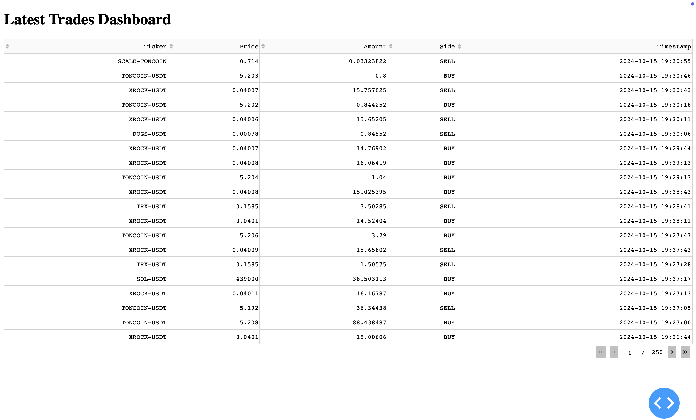

# Latest Trades Dashboard

This is a Dash-based web application that displays the latest trades for multiple cryptocurrency pairs from the TON Rocket exchange.



## Features

- Fetches and displays real-time trade data for multiple tickers
- Updates automatically every minute
- Sortable table with pagination
- Displays ticker, price, amount, side, and timestamp for each trade

## Prerequisites

Before running this application, make sure you have the following installed:

- Python 3.7+
- pip (Python package manager)

## Installation

1. Clone this repository or download the source code.

2. Navigate to the project directory:
   ```
   cd path/to/project
   ```

3. Install the required dependencies:
   ```
   pip install -r requirements.txt
   ```

## Configuration

The application reads ticker data from a `pairs_data.json` file. Ensure this file is present in the same directory as the script and has the correct structure:

```json
{
  "data": [
    {"name": "TICKER1"},
    {"name": "TICKER2"},
    ...
  ]
}
```

## Usage

To run the application:

1. Make sure you're in the project directory.

2. Run the following command:
   ```
   python dashboard.py
   ```

3. Open a web browser and go to `http://127.0.0.1:8050/` to view the dashboard.

## Customization

- To change the number of tickers displayed, modify the `tickers = tickers[:20]` line in the script.
- To adjust the update frequency, change the `interval` value (in milliseconds) in the `dcc.Interval` component.

## Troubleshooting

If you encounter any issues:

- Ensure all dependencies are correctly installed.
- Check that the `pairs_data.json` file exists and has the correct structure.
- Verify your internet connection, as the app needs to fetch data from an external API.

## Contributing

Contributions are welcome! Please feel free to submit a Pull Request.

